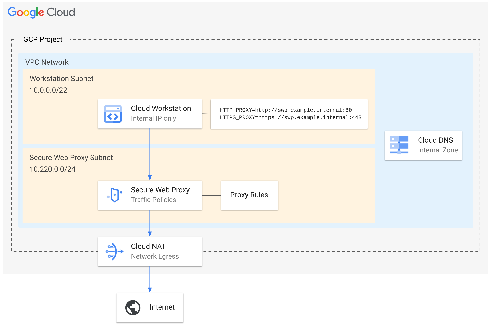

# Cloud Workstation with Secure Web Proxy

This example TF config provides a sample setup for locking down egress from Cloud Workstations with a Secure Web Proxy.

It sets up the following resources:

- VPC with Subnets for
    - Cloud Workstations
    - Secure Web Proxy
    - Regional Proxy Only Subnet

- Secure Web Proxy with URL Lists

- Cloud DNS Entries for the Secure Web Proxy

- Cloud Workstations with HTTP Proxy variables that point to the SWG



## Provisining

```sh
cd tf
terraform init
terraform apply --var project_id=$PROJECT_ID
```

## Clean Up

```sh
cd tf
terraform destroy --var project_id=$PROJECT_ID
```